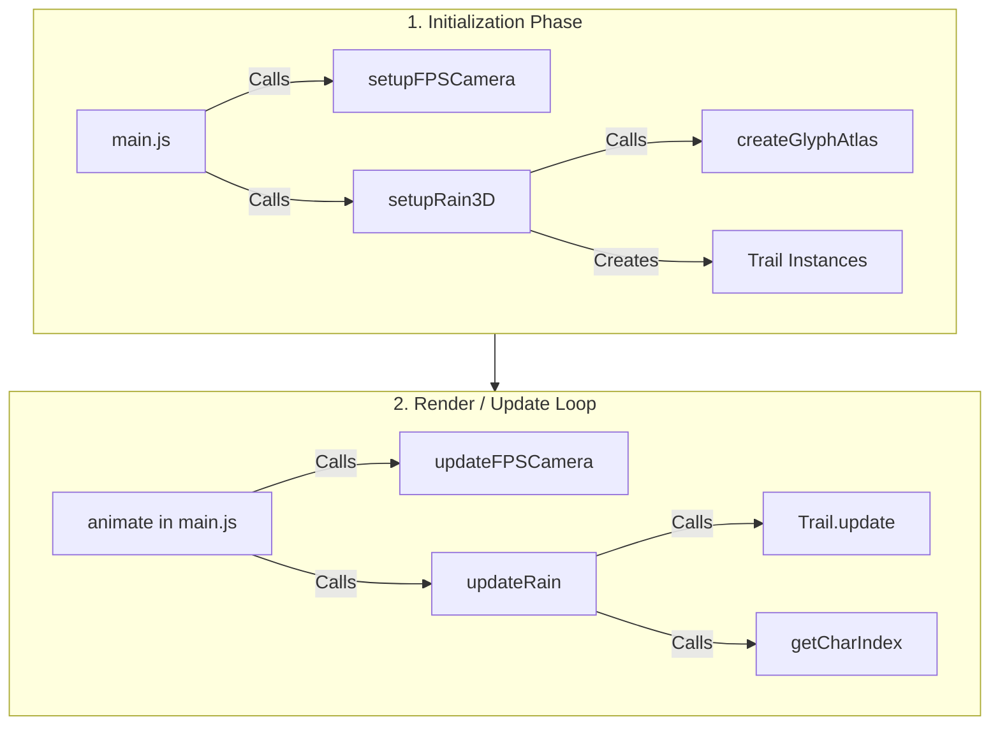

# Matrix Rain 3D: Architecture & Function Cheat Sheet

This document breaks down how the 3D Matrix Rain is built, detailing what each function does and how they interact to render the final infinite scene.

## Core Flow Chart

The application follows a standard game loop architecture: Initialization first, followed by a continuous Render/Update loop.

---

## 1. The Entry Point: `main.js`

This file is the nervous system of the application. It creates the Three.js scene, renderer, and cameras, and orchestrates the animation loop.

*   `animate(now)`: The continuous game loop powered by `requestAnimationFrame`. This function fires roughly 60-144 times a second. It delegates updates to all the moving parts of the system by calling their respective `update` functions.
*   `toggleFullscreen()`, `toggleHUD()`: Simple UI helpers bound to keyboard keys and mobile gestures.

---

## 2. The Rain System: `src/rain/matrix-3d.js`

This is the most complex file in the project. It handles the GPU instantiation and the "Sparse Instance Pool" logic.

*   **`setupRain3D(scene, initialCamera)`**: The initializer. 
    *   **What it does**: It builds a custom texture atlas using `createGlyphAtlas`. It then creates the `THREE.InstancedMesh` (the massive pool of clones) and heavily injects custom WebGL shader code (`material.onBeforeCompile`) to achieve the Y-Axis Billboarding effect.
    *   **What it returns**: It returns an object containing an `update` function (which gets assigned to `updateRain` in `main.js`) and a `resize` function.
*   **`spawnTrail(index, cameraPos)`** *(internal)*: 
    *   **What it does**: Drops a new rain "trail" into the world. It calculates a random position near the camera, a random falling speed, and a trail length. If the trail falls below the camera's view, this function is called again to "teleport" it back up.
*   **`getCharIndex(cx, cy, cz)`** *(internal)*: 
    *   **What it does**: The mathematical brain for stable characters. Instead of storing random characters in an enormous array, it takes a physical 3D world coordinate and mathematically hashes it into a specific character index from the texture atlas. 
    *   **Glitch logic**: It also uses the global time to make ~20% of the grid "glitch" and flip to a new character randomly.
*   **`update(deltaTime, camera)`** *(returned to main)*: 
    *   **What it does**: The engine room. Every frame, it checks every trail. If a trail is inside the camera's view frustum, it calculates where the trail's trailing characters should physically exist in 3D space, snaps those positions to a mathematical grid, and updates the `InstancedMesh` GPU buffers so they render.

---

## 3. The Supporting Actors

### `src/utils/fps-camera.js`
Handles the First Person movement (zero-gravity flying).
*   **`setupFPSCamera(camera, domElement)`**: Initializes the `THREE.Euler` rotation variables and hooks up the browser's Pointer Lock API so that mouse movements translate into pitch and yaw. It also tracks W/A/S/D and Space/Shift key presses.
*   **`updateFPSCamera(deltaTime, camera)`**: Called every frame. It translates the camera forward, backward, left, right, up, or down along the camera's *local* axes based on which keys are currently held down.

### `src/rain/glyph-atlas.js`
*   **`createGlyphAtlas(...)`**: A pure 2D Canvas utility. Before Three.js even renders a 3D frame, this function draws every single Matrix character in varying states of brightness (from glowing green to completely faded) onto a hidden 2D canvas. This canvas is then converted into a texture map and fed to the GPU, allowing the 3D planes to simply "look up" the character they need.

### `src/rain/trails.js`
*   **`class Trail`**: A very simple data structure holding a `position`, `direction`, `speed`, and `length`. 
*   **`Trail.update(deltaTime)`**: Merely advances the trail's invisible "head" downward based on its speed. The `matrix-3d.js` script handles drawing the visual tail behind this head.
