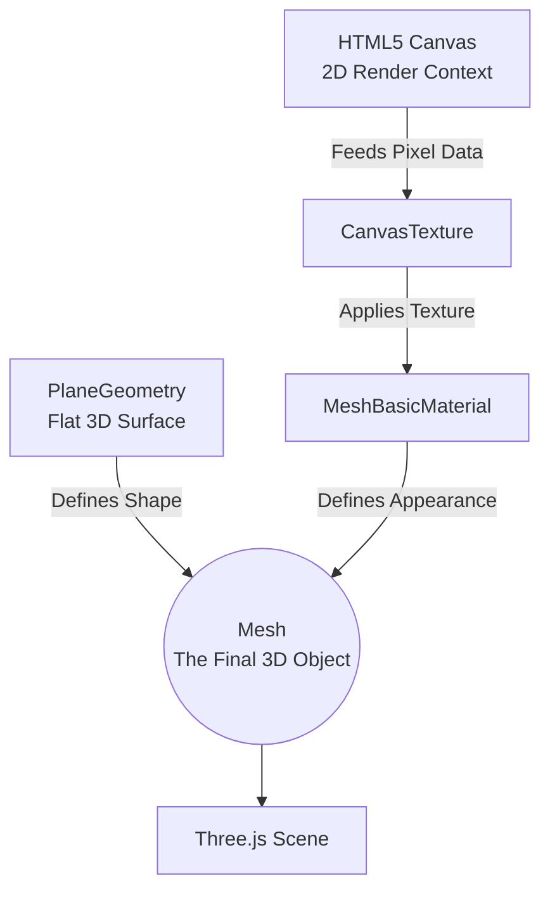
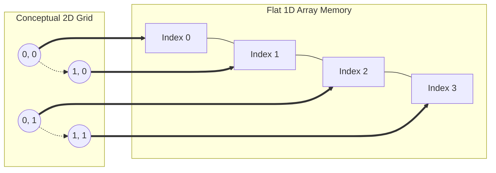

# Taking the Red Pill: Milestone 1 Complete

So, I set out to build the iconic Matrix code rain using Three.js and a 2D `CanvasTexture`. You know, the classic digital downpour. I started off feeling pretty confident. I got the basic Katakana and symbols falling, set up some mobile-friendly touch controls (double-tap for fullscreen, long-press to hide the UI), and had the visual aesthetic working. But then, I hit a massive wall: my CPU was crying, and the frame rate plummeted to a cinematic, yet entirely unacceptable, 8 to 10 FPS. 

## The Anatomy of Three.js

Before diving into the performance fixes, it helps to understand how we're actually getting this 2D rain into a 3D world. Three.js operates on a very specific hierarchy to render objects. To display our falling characters, we use a hidden HTML5 `<canvas>` element, which acts as the dynamic paintboard. That canvas is then fed into the Three.js pipeline:

We draw the Matrix rain onto the `Canvas`, pass it to a `CanvasTexture`, wrap that in a `Material`, and stretch it across a flat `PlaneGeometry` to create our final `Mesh`.

## The Catastrophe of `shadowBlur`

Turns out, rendering over a thousand text characters dynamically on a canvas every single frame is bad. But what really killed the machine was trying to make them glow. Using `ctx.shadowBlur` to give the text that authentic, CRT-monitor bloom effect was a catastrophic performance trap. The browser's CPU rasterizer was basically trying to calculate a Gaussian blur for every single character, every single frame. It was less "dodging bullets" and more "wading through molasses."

To fix this, I had to completely rethink the rendering architecture. I learned about—and implemented—a "Glyph Cache" (or Sprite Atlas). Instead of rendering and blurring text on the fly, the code now draws every character and its varying glow intensities into a hidden, off-screen canvas exactly *once* when the app loads. During the actual animation loop, I just use hardware-accelerated `drawImage` calls to copy those pre-rendered pixels directly onto the screen. 

Here is how the performance trade-off looks:

| Metric | Direct Text Rendering (`fillText` + `shadowBlur`) | Glyph Caching (Sprite Atlas + `drawImage`) | Improvement |
| :--- | :--- | :--- | :--- |
| **CPU Work / Frame** | Very High (Rasterizing 1,200 vectors & Gaussian blurs) | Negligible (1,200 simple memory bit blit copies) | **100x Less CPU Load** |
| **VRAM Footprint** | ~10 MB (Just the active canvas) | ~42 MB (Active canvas + Sprite Atlas cache) | **Slightly Higher Memory** |
| **Frame Rate** | 8 - 10 FPS | 60+ FPS (Locked) | **~600% Speedup** |

By trading a tiny bit of VRAM to bypass the CPU's text rendering engine, the app instantly locked in at a buttery smooth 60+ FPS.

## Down the Memory Rabbit Hole

I also went down the rabbit hole of memory optimization. Initially, I thought about storing the grid of characters in a standard 2D array (e.g., `grid[row][col]`), which makes intuitive sense for a 2D grid. But nesting thousands of array objects triggers garbage collection stutters and causes cache misses in the CPU. 

So, I switched to a flat, 1D `Uint16Array`. It allocates as one contiguous block of memory, making it blazingly fast.

I just wrote some simple inline math functions (`index = y * width + x`) to map 2D coordinates back into that 1D space, giving me the readability of a 2D grid with the raw speed of 1D memory.

## Decoupling Logic

Speaking of speed, I originally thought I'd need individual timers for every single cell to determine when a character should randomly flip to a new symbol. That sounded like a nightmare to manage. Instead, I discovered a neat probability trick. By taking the time elapsed since the last frame and dividing it by my target update interval, I get a global `changeProbability`. Now, I just loop over the grid and roll a single `Math.random() < changeProbability` for each cell. It creates the exact same visual flickering effect with almost zero overhead. 

Finally, I decoupled the drawing logic from the characters themselves. The grid array doesn't actually store Unicode strings anymore; it stores integer pointers that reference an active character set array. This means if I ever want to hot-swap the classic Matrix Katakana for, say, Norse Runes or binary code, I can do it instantly without touching the core rendering math. 

Milestone 1 is in the bag. We’ve established a highly performant 2D canvas texture. Next up: true 3D InstancedMesh columns. Time to see how deep this rabbit hole really goes.
